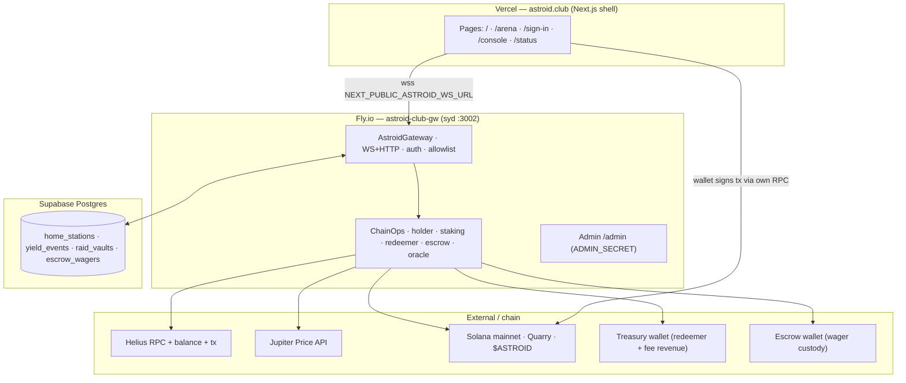
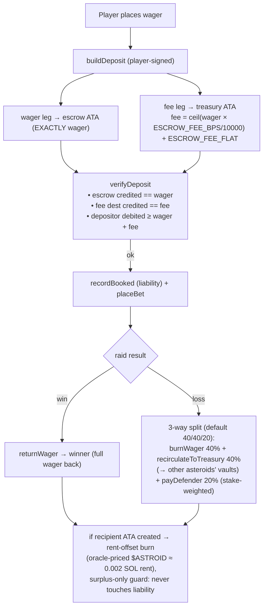
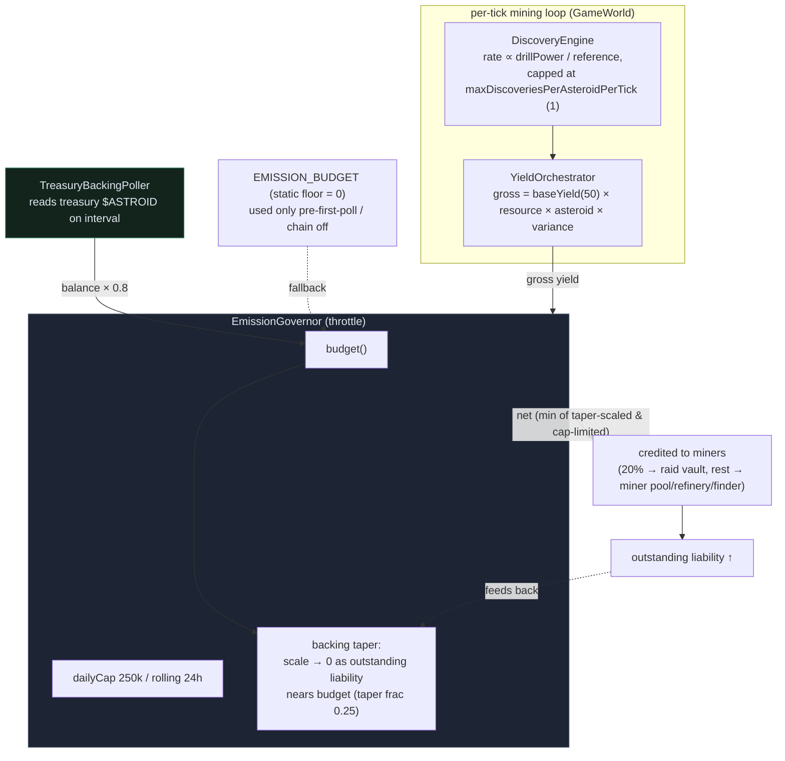

# Architecture

As-built architecture of `astroid-club`. Read this after [`../README.md`](../README.md) and [`GLOSSARY.md`](GLOSSARY.md). For player-facing mechanics, see [`GAME_DESIGN.md`](GAME_DESIGN.md).

---

## Three-tier layout

```
                       ┌─────────────────────────────────────────────┐
                       │  shell/    (Phase 2 — Next.js)              │
  Browser              │  · wallet sign-in (Privy)                   │
  ──────────────────►  │  · profile, hold-time, leaderboards         │
                       │  · admin console                            │
                       │  · static SEO pages (landing, rules)        │
                       │                                             │
                       │      ┌────────────────────────────────────┐ │
                       │      │  arena/  (Phase 2 — Vite)          │ │
                       │      │  · 3D asteroid arena (Three.js)    │ │
                       │      │  · ECS via bitecs                  │ │
                       │      │  · physics via cannon-es           │ │
                       │      │  · NetClient over ws to server     │ │
                       │      │  · mounted in shell via dynamic    │ │
                       │      │    import; iframe-isolated         │ │
                       │      └────────────────────────────────────┘ │
                       └─────────────────────────────────────────────┘
                                          │  ws (WSS in prod)
                                          ▼
                       ┌─────────────────────────────────────────────┐
                       │  server/    (this repo, AS-BUILT)           │
                       │  · WSGateway (engine) + HTTP health         │
                       │  · zod-validated Protocol                   │
                       │  · WalletVerifier sign-in (engine)          │
                       │  · GameWorld (12 ported modules)            │
                       │  · AntiCheatService (rate + sybil)          │
                       │  · ChainOps (kill-switch facade)            │
                       │  · HolderTracker + HolderChainAdapter       │
                       │  · Storage: in-memory or Redis              │
                       └─────────────────────────────────────────────┘
                                          │  optional, when CHAIN_ENABLED=true
                                          ▼
                       ┌─────────────────────────────────────────────┐
                       │  Solana                                     │
                       │  · $ASTROID SPL holder reads (Helius RPC)   │
                       │  · Yield sink (deferred, ChainOps slot)     │
                       │  · Bet escrow tx (deferred, ChainOps slot)  │
                       │  · Buyback (deferred, ChainOps slot)        │
                       └─────────────────────────────────────────────┘
```

Three layers, each with one job:

- **shell/** — meta-UI. Anything that is not the live arena lives here. Rendered server-side by Next.js where useful (SEO, wallet onboarding). Privy for wallet UX.
- **arena/** — the live game. A Vite-built standalone bundle that consumes `game-engine-enhanced` directly and talks to the server over the `NetClient`. Mounted into the shell via dynamic import (or an iframe) so it can be torn down and reloaded without disturbing the rest of the page.
- **server/** — authoritative game state. Composes the engine's transport primitives (`WSGateway`, `Protocol`, `WalletVerifier`) with a ported game economy and a single chain-side chokepoint (`ChainOps`).

---

## Why hybrid (Next.js shell + Vite arena)

| Concern                       | Next.js shell                 | Vite arena        |
| ----------------------------- | ----------------------------- | ----------------- |
| SEO landing pages             | ✅ SSR / SSG                  | ❌                |
| Wallet onboarding (Privy)     | ✅ official React patterns    | works but heavier |
| Admin console                 | ✅ App Router routing         | ❌                |
| Hot reload of game code       | slow                          | ✅ instant        |
| Bundle size of the live arena | bloated by Next overhead      | ✅ minimal        |
| Engine ergonomics             | awkward (Next bundler quirks) | ✅ native ESM     |

Picking either alone would compromise one side. The hybrid keeps each subsystem in the tooling it is best at.

---

## Server module map

```
server/
├── config/
│   └── runtime.ts             ← one-shot env read; chainEnabled, RPC, mint, ports
│
├── game/                      ← The ported BG raid economy. 12 modules, all DI'd via interfaces.ts
│   ├── types.ts               ← STAKE_TIERS, formulas (calculateAttackPower, …), GameEvent shapes
│   ├── interfaces.ts          ← *Like interfaces (no module-level singletons; everything is constructor-injected)
│   ├── world.ts               ← GameWorld composition root — owns one instance of every module
│   ├── asteroid-registry.ts   ← active-miner sets, drill-power totals, defense/attack buffs
│   ├── stake-manager.ts       ← stake records per (wallet, asteroid); home-station; tier resolution
│   ├── cooldowns.ts           ← per-(wallet,action) expiry timestamps
│   ├── expedition-tracker.ts  ← active-expedition records; join/leave; bet validation (≤20% stake)
│   ├── raid-engine.ts         ← raid resolution (1.2× defender advantage); pending-yield steal
│   ├── bet-escrow.ts          ← in-memory ledger for bet pools (loss split: 40% burn / 40% recirculate-to-vaults / 20% defenders, env-tunable)
│   ├── refinery-manager.ts    ← per-asteroid yield accumulator; finder/refinery split (70/30); distribution math
│   ├── distribution-service.ts← per-second drill-power-seconds accrual; routes to chain or addPendingYield
│   ├── yield-orchestrator.ts  ← periodic distribute-all loop; chain-gated payout
│   ├── syndicate-manager.ts   ← syndicate creation, membership, treasury split
│   └── syndicate-raids.ts     ← multi-attacker syndicate raids; treasury vs participant split
│
├── verification/
│   ├── anti-cheat.ts          ← per-wallet sliding rate limits; sybil detection (3+ IPs/hr); per-IP conn caps
│   └── holder-tracker.ts      ← in-memory flash-loan-mitigation; OR-combined hold-time / consecutive-obs gates
│
├── chain/                     ← ALL @solana/* imports live under here (audit invariant)
│   ├── index.ts               ← ChainOps facade — single chokepoint for chain ops
│   └── holder.ts              ← SolanaBalanceReader (Helius/RPC) + HolderChainAdapter (cache + tracker)
│
├── net/
│   ├── protocol.ts            ← zod-validated wire protocol (extends engine's Protocol)
│   └── gateway.ts             ← AstroidGateway: WSGateway + WalletVerifier + GameWorld dispatch + anti-cheat
│
└── index.ts                   ← entrypoint; HTTP /health; ChainOps construction; gateway.start; graceful shutdown
```

**Single ownership tree.** `GameWorld` is the only place that constructs game-module instances. Every cross-module dependency is a constructor argument typed as a narrow `*Like` interface from `interfaces.ts`, so there are no `getXManager()` chains and no module-level singletons.

**Single chain chokepoint.** Every chain-touching operation must go through `ChainOps`. The audit invariant — `@solana/*` imports may only appear under `server/chain/` — is currently maintained manually (`rg "from '@solana" server/`) and will become an ESLint rule in a follow-up slice.

---

## How the server sits on top of the engine

The engine ships these primitives, which `astroid-club` consumes rather than re-implementing:

| Engine primitive    | Used in astroid-club for                                               |
| ------------------- | ---------------------------------------------------------------------- |
| `WSGateway`         | The websocket transport, room model, message dispatch                  |
| `Protocol` (zod)    | Wire schemas; we extend with our own `GameMessage` discriminated union |
| `Connection`        | Per-client metadata (we stamp `walletAddress` after auth)              |
| `WalletVerifier`    | Cryptographic signature on the auth message; nonce issuance            |
| `RateLimiter`       | Per-connection throttling for messages                                 |
| `Storage` + Redis   | (Phase 3) Persistence for asteroids, leaderboards, expedition timers   |
| `SplRewardSink`     | (deferred) Yield payout when chain is on                               |
| `PublicKey`, `bs58` | base58 decode / encode for nonces — no RPC                             |

Everything else — the **game-specific** logic — lives in `server/game/` and is the port of Black-Gold's economy.

---

## How the chain flag works

`CHAIN_ENABLED` is the single switch that determines whether on-chain side effects actually execute or are no-ops. It is read once at server boot and threaded through three independent gating layers.

```
         ┌─────────────────────────────────────────────┐
         │ Layer 1: env flag (runtime.chainEnabled)    │
         │   - one bit; flips the platform             │
         │   - requireEnv throws if RPC/mint missing   │
         │     when chain is on                        │
         └────────────────────┬────────────────────────┘
                              │
         ┌────────────────────▼────────────────────────┐
         │ Layer 2: orchestrator gates                 │
         │   - DistributionService.chainEnabled        │
         │   - YieldOrchestrator.chainEnabled          │
         │   - never invoke onYieldPayout when off     │
         │   - route to addPendingYield instead        │
         └────────────────────┬────────────────────────┘
                              │
         ┌────────────────────▼────────────────────────┐
         │ Layer 3: ChainOps facade                    │
         │   - server/chain/index.ts                   │
         │   - every chain op re-asserts chainEnabled  │
         │   - returns disabled sentinel when off      │
         │   - throws ChainOpNotImplementedError when  │
         │     on but no impl wired (boot fails loud)  │
         └─────────────────────────────────────────────┘
```

Adding a new chain SDK call to a random module bypasses layer 2; it cannot bypass layer 3 because the SDK is restricted to `server/chain/*`. The fail-loud-not-degrade design is intentional — losing user funds via a silent no-op is worse than crashing at boot.

See [`CHAIN_AUDIT.md`](CHAIN_AUDIT.md) for the surface inventory and per-op gating status.

---

## Authentication flow

```
 client                                        server (AstroidGateway)
   │                                                  │
   │  ws connect                                      │
   │ ───────────────────────────────────────────────► │
   │                                                  │  onConnection: anti-cheat IP cap check
   │                                                  │
   │  { type: 'request_nonce', walletAddress }        │
   │ ───────────────────────────────────────────────► │
   │                                                  │  WalletVerifier.issueNonce(addr)
   │  { ok, data: { nonce, message, ttlMs } }         │
   │ ◄─────────────────────────────────────────────── │
   │                                                  │
   │  // client signs `message` (canonical with        │
   │  //   timestamp:0; engine-bug workaround)         │
   │                                                  │
   │  { type: 'auth', walletAddress, nonce, sig }     │
   │ ───────────────────────────────────────────────► │
   │                                                  │  WalletVerifier.verifySignedAction
   │                                                  │  conn.meta.walletAddress = addr
   │                                                  │  world.connectPlayer(addr)
   │  { ok, data: ConnectSnapshot }                   │
   │ ◄─────────────────────────────────────────────── │
   │                                                  │
   │  // game messages (join_asteroid, stake, …)      │
   │ ───────────────────────────────────────────────► │
   │                                                  │  anti-cheat per-action rate limit
   │                                                  │  GameWorld dispatch
   │  { ok, data } | { ok: false, code, message }     │
   │ ◄─────────────────────────────────────────────── │
```

The signing message format is `{ app, action: 'auth', nonce, timestamp: 0 }` — the `timestamp: 0` is intentional, working around an engine bug where `createSignatureMessage` and `verifySignedAction` use different timestamps. Documented in `server/net/gateway.ts`.

---

## Storage model

State is currently in-memory across the world's modules. Each module exposes its state through narrow getters (`world.registry.getAsteroid(id)`, `world.stakeManager.getMinerState(wallet)`) so a Redis-backed implementation can be swapped in without changing call sites.

| Store             | What lives there                                          | Why                                        |
| ----------------- | --------------------------------------------------------- | ------------------------------------------ |
| Asteroid registry | Per-asteroid records (active miners, drill total, buffs)  | The world state. Read-heavy.               |
| Refineries        | Per-asteroid yield accumulators                           | Tick-updated; resets on distribution.      |
| Stakes            | `Stake` records keyed by `(wallet, asteroid)`             | Authoritative source for drill-power tier. |
| Expeditions       | Per-wallet active-expedition records                      | Time-limited; exclusive per wallet.        |
| Cooldowns         | `(wallet, action)` → expiry timestamp                     | Tiny but hot.                              |
| Bet escrow        | Raid pools + per-wallet bets                              | In-memory ledger; chain-tx layer deferred. |
| Holder tracker    | `wallet` → `{ firstSeenAboveThresholdMs, consecObs, … }`  | Drives flash-loan mitigation.              |
| Pending yield     | Per-(wallet, asteroid) IOU when chain is off              | Banked via `claim_yield` message.          |
| Anti-cheat        | Per-wallet sliding-window rate counts; per-IP wallet sets | Throttling and sybil detection.            |

For dev, in-memory is enough. For production, a Redis-backed implementation can replace each store individually since they are accessed through interfaces.

---

## What is **not** in this repo

- The engine itself — that lives in `../game-engine-enhanced/` and is consumed via `file:`.
- The token contract — `$ASTROID` is a plain SPL token; there is no custom Solana program owned by this repo.
- The on-chain reward / staking program — when chain is on, `astroid-club` will use the engine's reward sink and (optionally) the optional Quarry staking provider. No bespoke Anchor program.
- A bundled frontend — Phase 2 lands `shell/` and `arena/`.
- Marketing / business / legal artifacts — those live in `../astroid-proposal/`.

---

## Phasing recap

- **Phase 0 — scaffold.** ✅ Repo, package.json, tsconfig, lint, test wiring, glossary.
- **Phase 1 — server port.** ✅ All 12 game modules ported. Anti-cheat, holder verification, server entrypoint, WSGateway integration, `ChainOps` facade with three-layer kill switch, BG simulation tests rethemed (590 tests).
- **Phase 2 — frontend.** ⏳ Next.js shell + Vite arena scaffold. Privy wallet sign-in, profile, leaderboards, admin console. Closed-cohort holder mint and a one-shot raid demo.
- **Phase 3 — chain wiring.** ⏳ Implement the four `ChainOps` impls behind their respective slices: `executeYieldPayout`, `buildBetEscrowDeposit` + `verifyBetEscrowDeposit`, `executeBuyback`. Each impl lives under `server/chain/` and is unit-tested with injected fakes.
- **Phase 4 — content.** ⏳ Poker freeroll service. Tournament directors, sponsor pools, leaderboards. PvP arena seasons. PvE world events.

Each phase is intentionally narrow so it can be reviewed in isolation.

---

## Deployment & secret topology

How the running system is wired across hosts, and **where every secret lives**
(the recurring footgun during key rotation).



| Secret | Host | Notes |
| --- | --- | --- |
| `ADMIN_SECRET`, `HELIUS_API_KEY`, `SOLANA_RPC_URL` | **Fly only** | never on Vercel |
| `REDEEMER_TREASURY_PRIVATE_KEY`, `ESCROW_PRIVATE_KEY`, `DATABASE_URL` | **Fly only** | hot wallets + DB |
| `HOLDER_MIN_SOL/BALANCE/HOLD_SECONDS`, `ESCROW_FEE_BPS/FLAT`, `ESCROW_RENT_BURN_ENABLED` | **Fly only** | gate + escrow economics |
| `NEXT_PUBLIC_*` (WS URL, Privy app id, site URL, chain, arena flag) | **Vercel** | browser-exposed |
| `NEXT_PUBLIC_SOLANA_RPC_URL` | **Vercel** | dev-keypair path only; prod wallets use their own RPC |

**Rule of thumb:** secret/server-side → **Fly**; `NEXT_PUBLIC_*` → **Vercel**.
Rotating Helius/Admin/RPC requires **no Vercel change**.

---

## Raid-wager escrow money flow

Custody is the dedicated `ESCROW_PRIVATE_KEY` wallet; the escrow-creation fee
(protocol revenue) goes to the mining treasury (`REDEEMER_TREASURY_PRIVATE_KEY`).



On a loss the forfeit is split three ways (`RAID_LOSS_BURN_BPS` /
`RAID_LOSS_RECIRCULATE_BPS` / `RAID_LOSS_DEFENDER_BPS`, must sum to 10000): the
**recirculate** share is credited to OTHER asteroids' raid vaults in-game (fresh
stealable bounty) and moved on-chain to the redeemer treasury that backs those
vaults, so value stays in play instead of being destroyed. Undelivered defender
share (no eligible defenders) rolls into recirculation; burn takes the remainder
so the legs sum exactly to the wager (escrow nets to zero).

- **Fee** (`ESCROW_FEE_BPS` + `ESCROW_FEE_FLAT`, default 2% + 5,000): charged
  on top, → treasury revenue. The escrow ATA still receives exactly the wager,
  so the security-critical exact-credit verify gate is unchanged.
- **Rent-offset burn** (`ESCROW_RENT_BURN_ENABLED`): when the escrow wallet
  fronts SOL rent for a new recipient ATA, it burns the oracle-priced $ASTROID
  equivalent from **surplus only** (`balance − outstanding liability ≥ burn`).

## Mining economy & emission control

Issuance can never outrun what the treasury can actually pay out. The budget is
**pegged to the live redeemer-treasury balance**, not a static number.



- **Dynamic budget**: `TreasuryBackingPoller` reads the redeemer treasury balance
  on an interval; `budget = balance × EMISSION_BACKING_FRACTION` (0.8). As
  liability approaches 80% of payable reserves, issuance tapers to zero; as the
  treasury is topped up, headroom re-opens automatically — so it scales from a
  handful of testers to 100+ wallets without a manual retune.
- **Daily cap** (`EMISSION_DAILY_CAP` = 250k): a rolling-24h hard ceiling that
  smooths bursts even when backing headroom exists.
- **Base yield** (`YIELD_BASE_PER_DISCOVERY` = 50): the pre-multiplier reward per
  discovery (was 100).

### Drill power & the "23M" question

Effective drill power is **not** a free number — it is bounded by stake and then
scaled by the stake tier:

```
boundedBase = min(self_reported, DRILL_BASE_FREE + stake × DRILL_BASE_PER_STAKE)
            = min(self_reported, 5000 + stake × 1)
effective   = boundedBase × tierMultiplier        # Diamond = 3.0×
```

So a **23,000,000** effective drill reading implies `boundedBase ≈ 7.67M`, i.e.
the wallet **staked ~7.66M $ASTROID** (`23M / 3 − 5000`). Given the anti-spoof
bound is on, that number is *accurate for Diamond tier with a large stake* — it
is not an exploit of the self-reported value.

Two consequences worth knowing:

- **Mining is unaffected above ~5k drill.** Discovery rate is capped at
  `maxDiscoveriesPerAsteroidPerTick` (1), which saturates at roughly the
  reference drill power. 23M vs 5k mines at the *same* speed — the giant number
  is cosmetic for yield. (The fast-100k issue was emission tuning, now fixed.)
- **Raids are soft-capped.** `attackPower = softCapAttackDrill(drill) × 0.5 +
  stake × 0.1`. Drill once scaled linearly + unbounded (23M drill → ~12M attack
  power → faceroll). Now, above `RAID_DRILL_SOFTCAP` (5M) each extra point of
  drill counts at only `RAID_DRILL_SOFTCAP_SLOPE` (0.15) — diminishing returns:

  ```
  softCapAttackDrill(drill) = drill                              (drill ≤ 5M)
                            = 5M + (drill − 5M) × 0.15           (drill > 5M)
  ```

  The 23M whale drops from ~12M to ~4.6M attack power, while a solid Diamond
  player (< 5M drill) is untouched. Staking more is still always better — it's
  lucrative to be a whale, just no longer linearly dominant. The stake term is
  unchanged; `RAID_DRILL_SOFTCAP=0` disables it. Mining/discovery never touched.
